
<h1>Forecasting the quality of cloud services using an LSTM network</h1>

* * *
This repository manages the files used in the experiments of the paper:
_**Forecasting the quality of cloud services using an LSTM network**_
* * *

    

The following section presents the results obtained for the 16 variables used to develop the experiment, as well as additional information related to them.

These results are:

* Representation of the **_datasets_**  with the observations of 16 QoS metrics extracted from the cloud service SAlert monitoring.
* Model validation metrics consisting of **_RMSE, MAE, MAPE_**
* Model fitting on the training dataset and prediction on the test dataset.

## _Datasets_

| Variable            | Dataset                                                                  |
|---------------------|----------------------------------------------------------------------------|
| Free Memory         | 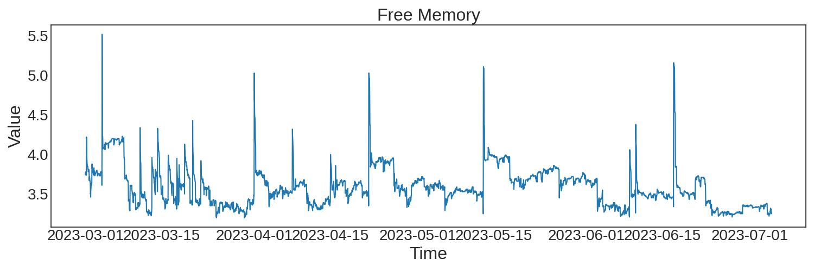               |
| Used Memory         | 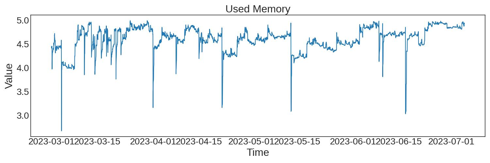               |
| Free Disk           | 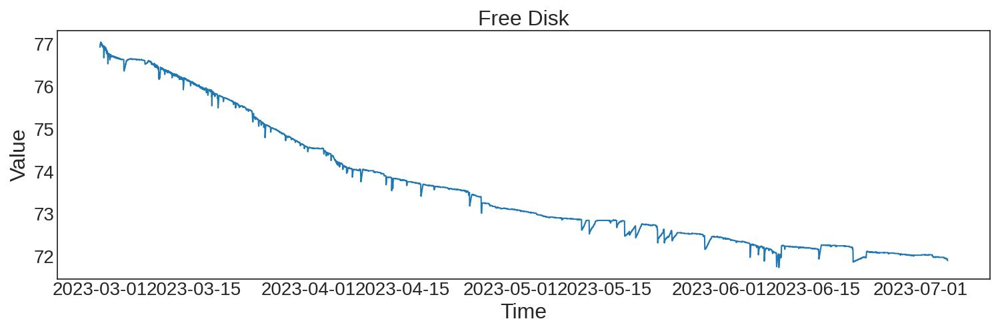                   |
| Used Disk           | 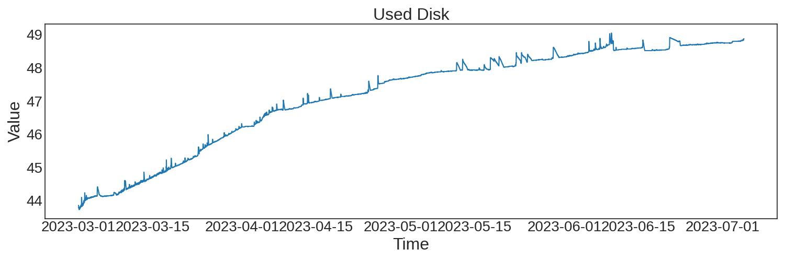                   |
| Disk read/s         | 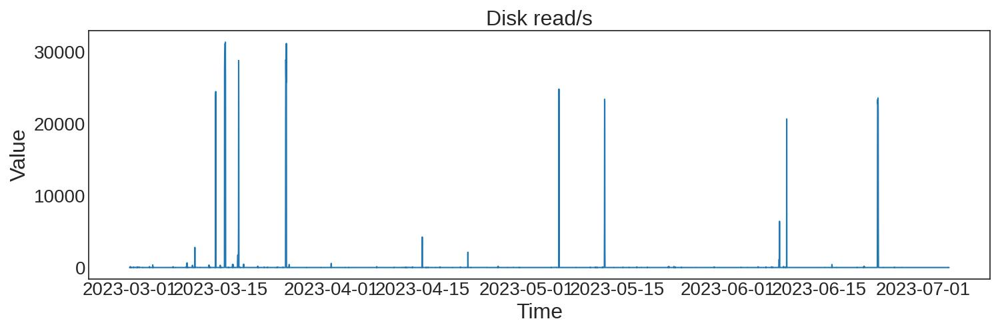               |
| Disk write/s        | 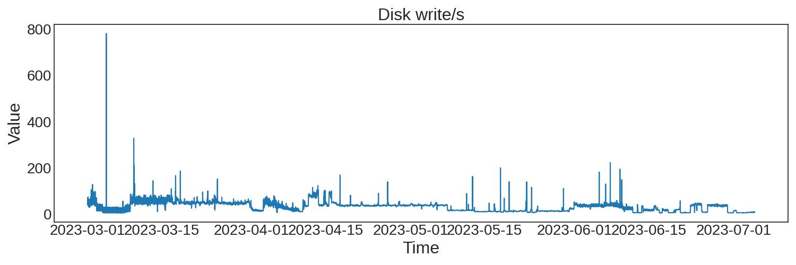             |
| NetBytes In         | 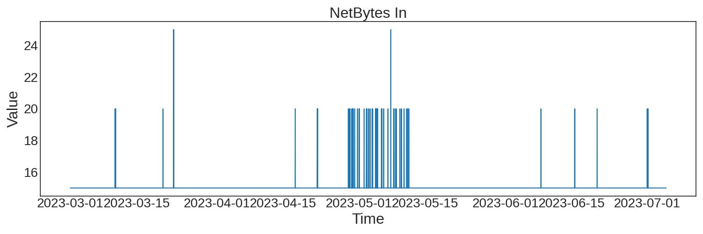               |
| NetBytes Out        |              |
| NetPackets In       |            |
| NetPackets Out      |  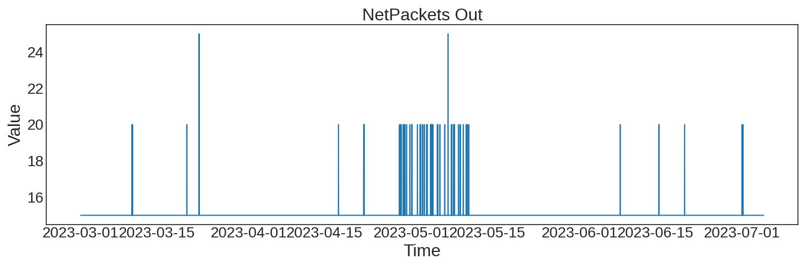          |
| Rx packets          | 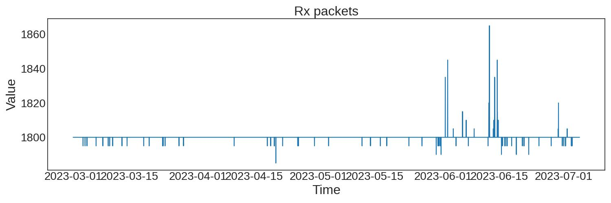                 |
| Tx packets          |                  |
| CPU percent         | 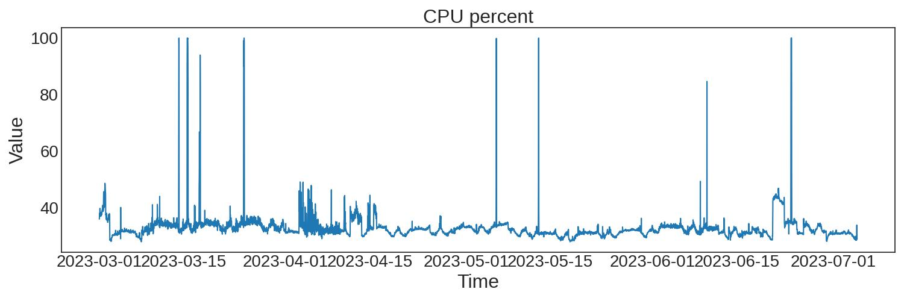         |
| Memory Used percent | 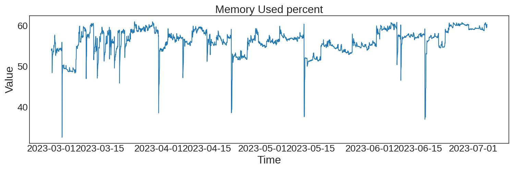       |
| Disk Used percent   | 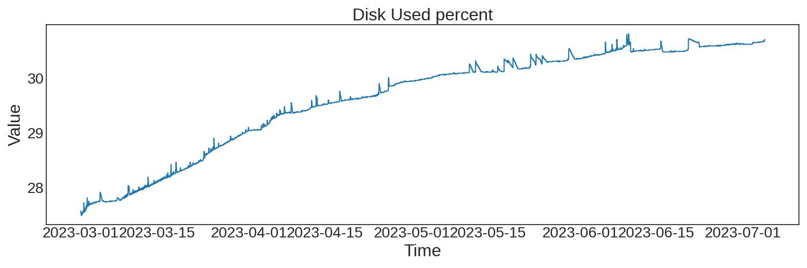 |
| Uptime              | 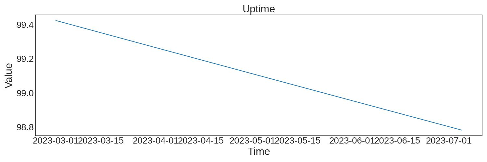                     |

## Metrics

| Variable            | RMSE                                                                     | MAE                                                                     | MAPE                                                                     | 
|---------------------|--------------------------------------------------------------------------|-------------------------------------------------------------------------|--------------------------------------------------------------------------|
| **_Free Memory_**        
Iteration 1|                    |                     |                    | 
|Iteration 2         |                    |                     |                    | 
| Iteration 3        |                    |                     |                    | 
| **_Used Memory_**         
Iteration 1|                    |                     |  | 
| Iteration 2         |                    |                     |  | 
| Iteration 3         |                    |    |           | 
| **_Free Disk_**           
Iteration 1|  |  |         | 
|Iteration 2|  |  |         | 
|Iteration 3|  |  |         | 
| **_Used Disk_**           |  | 
 |  |  | 
| Disk read/s         |                    |                     |                    | !
| Disk write/s        |                  |                  |                  |                  |
| NetBytes In         |                    |                    |                    | 
| NetBytes Out        |                  |                  |                  | 
| NetPackets In       |                |                |                | 
| NetPackets Out      |                                                                          |                                                                         |                                                                          |   
| Rx packets          |                      |                      |                      | 
| Tx packets          |                      |                      |                      | 
| CPU percent         |                    |                     |                    | 
|         |                    |                     |                    | 
|         |                    |                     |   
| Memory Used percent |  |  |  | 
| Disk Used percent   |      |      |      | 
| Uptime              |                                |                                |                                | 

## ARIMA Model Prediction 

| Variable            | Iteration 1                                                                            | Iteration 2                                                                                   | Iteration 3  | 
|---------------------|------------------------------------------------------------------------------------------|--------------------------------------|--------------------------------------------------|
| Free Memory         |                    |                    |
| Used Memory         |                    |                    |
| Free Disk           |                        |                        |
| Used Disk           |                        |                        |
| Disk read/s         |                    |                    |
| Disk write/s        |                  |                  |
| NetBytes In         |                    |                    |
| NetBytes Out        |                  |                  |
| NetPackets In       |                |                |
| NetPackets Out      |                                                                                          |                                                                                        |
| Rx packets          |                      |                      |
| Tx packets          |                      |                      |
| CPU percent         |                    |                    |
| Memory Used percent |  |  |
| Disk Used percent   |      |      |
| Uptime              |                                |                                |

## LSTM Model Results

| Variable            | Training                                                                            | Testing                                                                                |
|---------------------|------------------------------------------------------------------------------------------|----------------------------------------------------------------------------------------|
| Free Memory         |                    |                    |
| Used Memory         |                    |                    |
| Free Disk           |                        |                        |
| Used Disk           |                        |                        |
| Disk read/s         |                    |                    |
| Disk write/s        |                  |                  |
| NetBytes In         |                    |                    |
| NetBytes Out        |                  |                  |
| NetPackets In       |                |                |
| NetPackets Out      |                                                                                          |                                                                                        |
| Rx packets          |                      |                      |
| Tx packets          |                      |                      |
| CPU percent         |                    |                    |
| Memory Used percent |  |  |
| Disk Used percent   |      |      |
| Uptime              |                                |                                |

