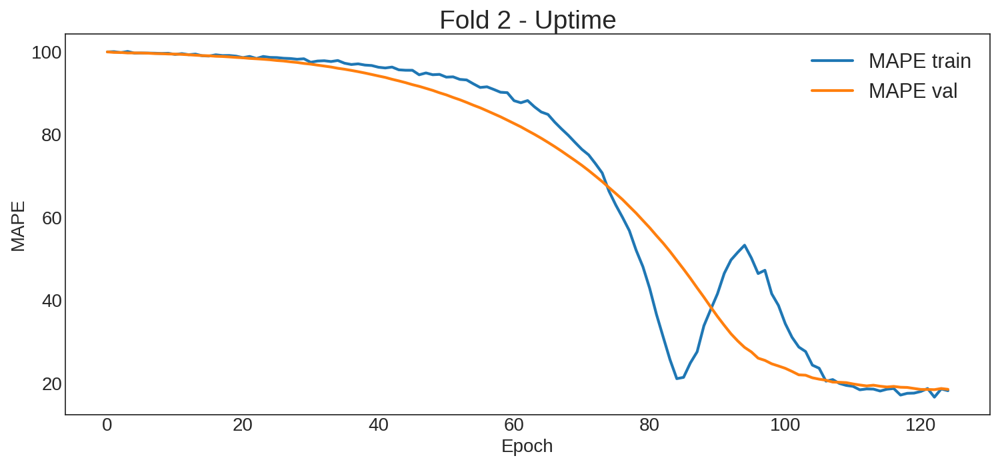
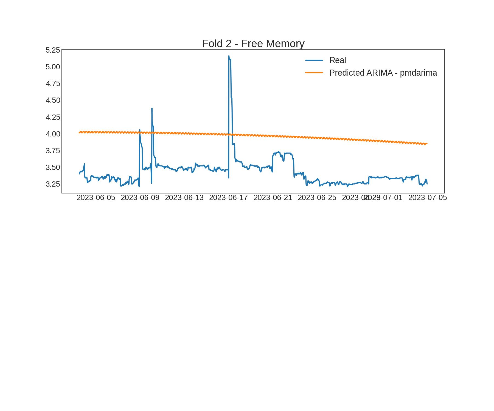
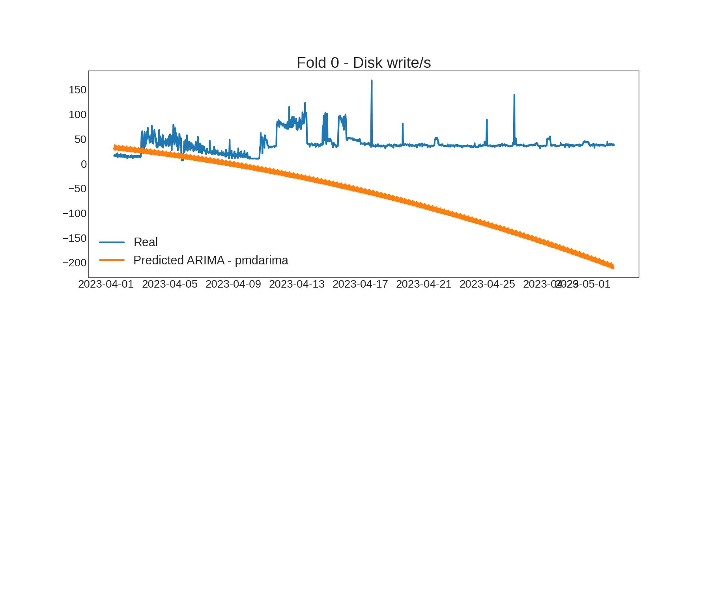
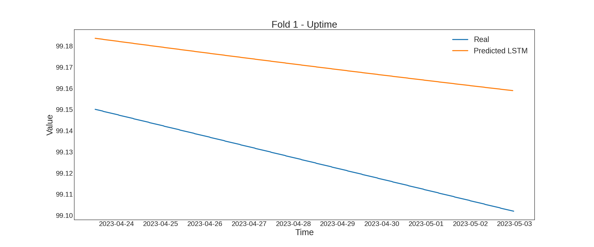

<h1>Forecasting the quality of cloud services using an LSTM network</h1>

* * *
This repository manages the files used in the experiments of the paper:
_**Forecasting the quality of cloud services using an LSTM network**_
* * *

    

The following section presents the results obtained for the 16 variables used to develop the experiment, as well as additional information related to them.

## Index
1. [Dataset](#datos)
2. [LSTM Accuracy Metrics](#Metric)
3. [ARIMA model predictions](#ARIMA)
4. [LSTM model predictions](#LSTM)

## _Datasets_ {#Datos}
Representation of the **_datasets_**  with the observations of 16 QoS metrics extracted from the cloud service SAlert monitoring.

| Variable            | Dataset                                                                  |
|---------------------|----------------------------------------------------------------------------|
| Free Memory         |                |
| Used Memory         |                |
| Free Disk           |                    |
| Used Disk           |                    |
| Disk read/s         |                |
| Disk write/s        |              |
| NetBytes In         |                |
| NetBytes Out        |              |
| NetPackets In       |            |
| NetPackets Out      |            |
| Rx packets          |                  |
| Tx packets          |                  |
| CPU percent         |          |
| Memory Used percent |        |
| Disk Used percent   |  |
| Uptime              |                      |

## LSTM Accuracy Metrics {#Metric}
LSTM model performance evaluation using accuracy metrics **_RMSE, MAE, MAPE_** 

| Variable            | RMSE                                                                     | MAE                                                                     | MAPE                                                                     | 
|---------------------|--------------------------------------------------------------------------|-------------------------------------------------------------------------|--------------------------------------------------------------------------|
| **_Free Memory_**        
Iteration 1|                    |                     |                    | 
|Iteration 2         |                    |                     |                    | 
| Iteration 3        |                    |                     |                    | 
| **_Used Memory_**         
Iteration 1|                    |                     |  | 
| Iteration 2         |                    |                     |  | 
| Iteration 3         |                    |    |           | 
| **_Free Disk_**           
Iteration 1|  |  |         | 
|Iteration 2|  |  |         | 
|Iteration 3|  |  |         | 
| **_Used Disk_**
Iteration 1|  |  |  | 
|Iteration 2|  |  |  | 
|Iteration 3|  |  |  | 
| **_Disk read/s_**
Iteration 1| | 	 | 	 | 
|Iteration 2| | 	 | 	 | 
|Iteration 3| | 	 | 	 | 
| **_Disk write/s_**
Iteration 1| | 	 | 	 | 
|Iteration 2| | 	 | 	 | 
|Iteration 3| | 	 | 	 | 
| **_NetBytes In_**     
Iteration 1|  | 	 | 	 | 
|Iteration 2|  | 	 | 	 | 
|Iteration 3|  | 	 | 	 | 
| **_NetBytes Out_**  
Iteration 1 | | 	 | 	 | 
|Iteration 2 |  | 	 | 	 |
|Iteration 3 |  | 	 | 	 |
| **_NetPackets In_**   
Iteration 1|  | 	 | 	 | 
|Iteration 2|  | 	 | 	 | 
|Iteration 3|  | 	 | 	 | 
| **_NetPackets Out_**   
Iteration 1| | 	 |  | 
|Iteration 2| | 	 |  | 
| Iteration 3| | 	 |  |              
| **_Rx packets_**    
Iteration 1| | 	 | 	 | 
|Iteration 2| | 	 | 	 | 
|Iteration 3| | 	 | 	 | 
| **_Tx packets_**         
Iteration 1 | | 	 | 	 | 
|Iteration 2 | | 	 | 	 | 
|Iteration 3 | | 	 | 	 | 
| **_CPU percent_**
Iteration 1|                    |                     |  | 
|Iteration 2         |                    |                     |  | 
| Iteration 3|                    |                     |   
| **_Memory Used percent_** 
Iteration 1 | | 	 | 	 | 
|Iteration 2 | | 	 | 	 |
|Iteration 3 | | 	 | 	 |
| **_Disk Used percent_**  
Iteration 1 | | 	 | 	 | 
Iteration 2 | | 	 | 	 |
Iteration 3 | | 	 | 	 |
| **_Uptime_**
Iteration 1 |  | 	 | 	 | 
|Iteration 2 |   | 	 | 	 | 
|Iteration 3 |   | 	 | 	 | 

## ARIMA Model Prediction {#ARIMA}
ARIMA Model fitting with prequential cross-validation

| Variable            | Iteration 1                | Iteration 2              | Iteration 3  | 
|---------------------|-----------------------|--------------------------------------|-----------------------|
| Free Memory         |  | 	 | 	 | 
| Used Memory         |  | 	 | 	 |   
| Free Disk           |  | 	 | 	 | 
| Used Disk           |  | 	 | 	 | 
| Disk read/s         |  | 	 | 	 | 
| Disk write/s        |  | 	 | 	 | 
| NetBytes In         |  | 	 | 	 | 
| NetBytes Out        |  | 	 | 	 | 
| NetPackets In       |  | 	 | 	 | 
| NetPackets Out      |   | 	 | 	 |
| Rx packets          |  | 	 | 	 | 
| Tx packets          |  | 	 | 	 | 
| CPU percent         |  | 	 | 	 | 
| Memory Used percent |  | 	 | 	 | 
| Disk Used percent   |  | 	 | 	 | 
| Uptime              | | 	 | 	 | 

## LSTM Model Prediction {#LSTM}
LSTM Model fitting with prequential cross-validation

| Variable            | Iteration 1                | Iteration 2              | Iteration 3  | 
|---------------------|-----------------------|--------------------------------------|-----------------------|
| Free Memory         | | 	 | 	| 
| Used Memory         |  | 	 | 	|
| Free Disk           |  | 	 | 	 |  
| Used Disk           |  | 	 | 	 | 
| Disk read/s         |  | 	 | 	 | 
| Disk write/s        |  | 	 | 	 | 
| NetBytes In   |  | 	 | 	| 
| NetBytes Out        |  | 	 | 	 | 
| NetPackets In       |  | 	 | 	 |
| NetPackets Out      |    | 	 | 	 | 
| Rx packets          |  | 	 | 	 | 
| Tx packets          |  | 	 | 	 | 
| CPU percent         |  | 	 | 	| 
| Memory Used percent |  | 	 | 	 | 
| Disk Used percent   |  | 	 | 	 | 
| Uptime              |  | 	 | 	 | 

